# Applicant Tracking System
*Made for Human Resources interviewers for tracking their applicants, a simple tracking system.*

## Previews
| Screen | Light | Dark |
|--------|------|------|
| Hero | 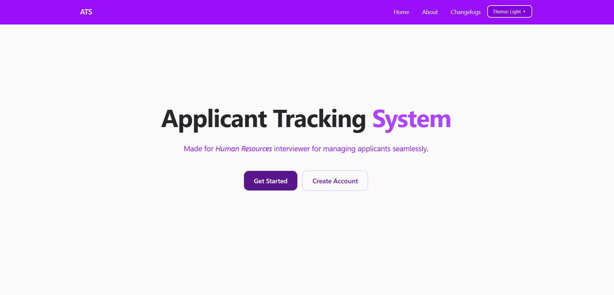 | 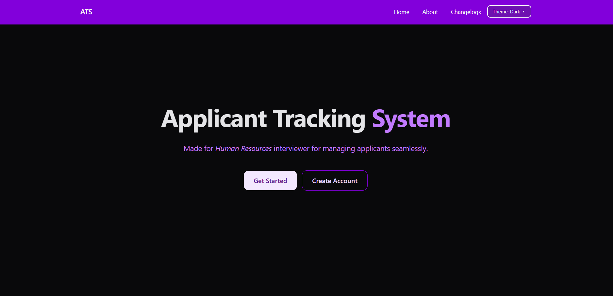 |
| Login | 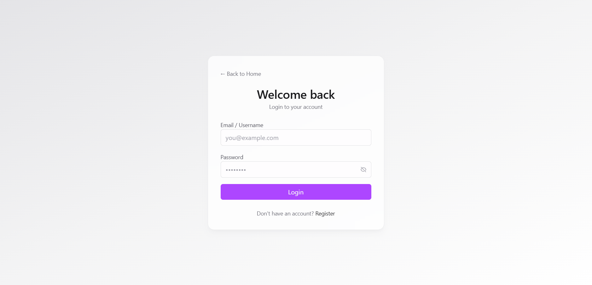 | 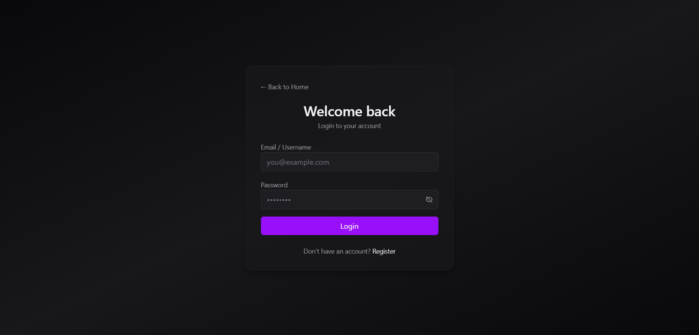 |
| Admin Dashboard | 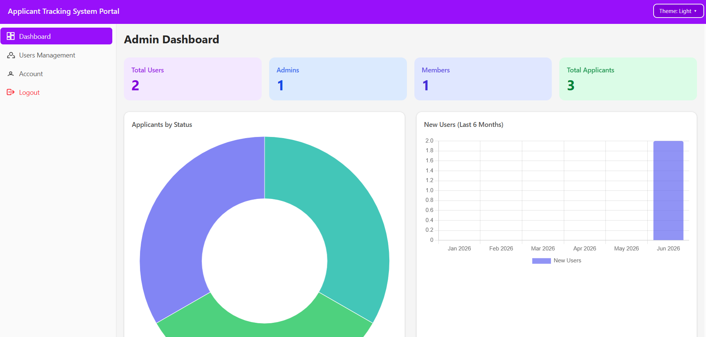 | 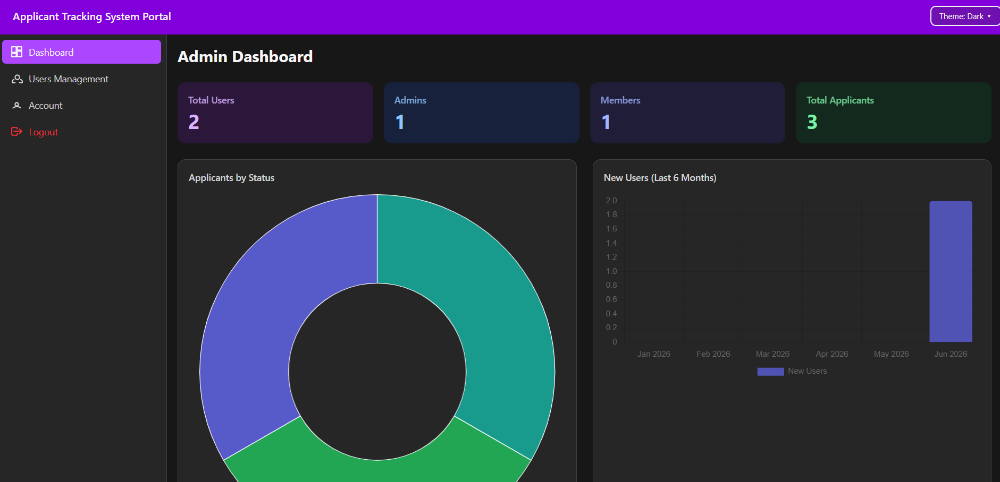 |
| Admin Users | 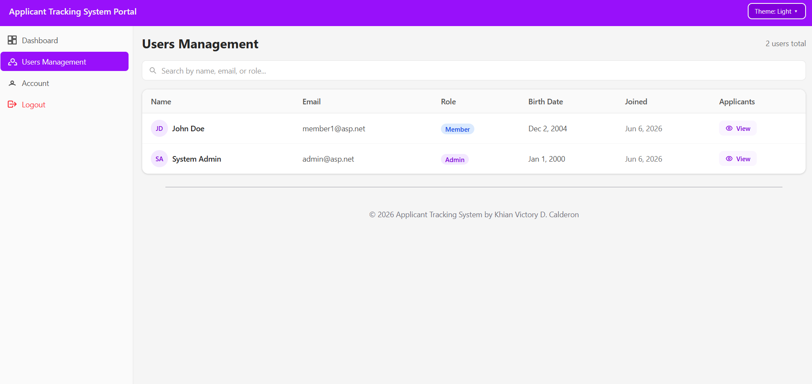 | 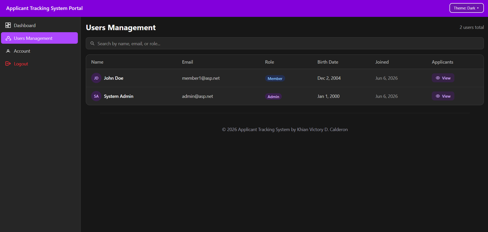 |
| Users Dashboard | 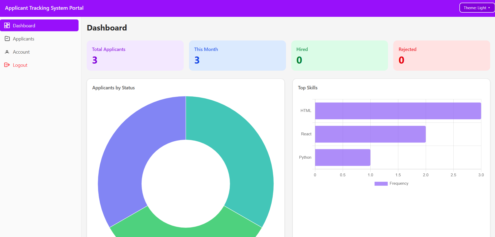 | 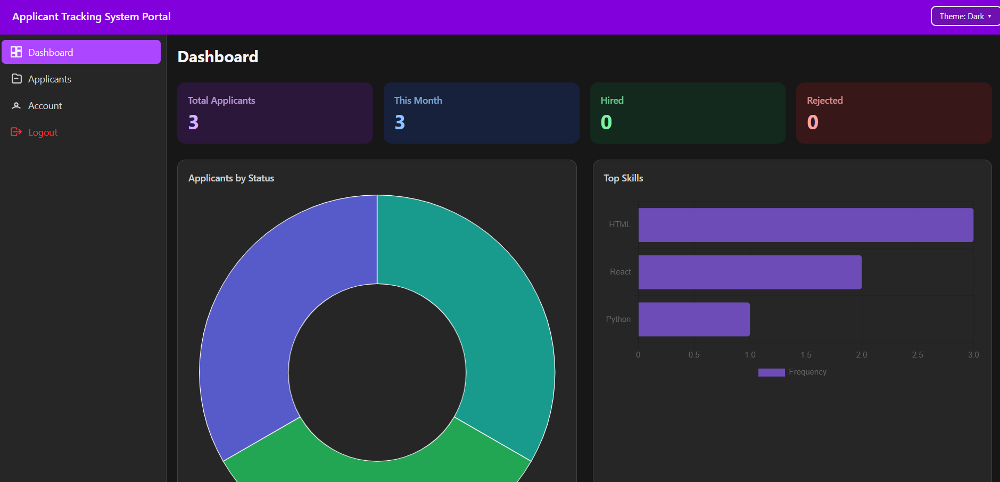 |
| Users Applicants | 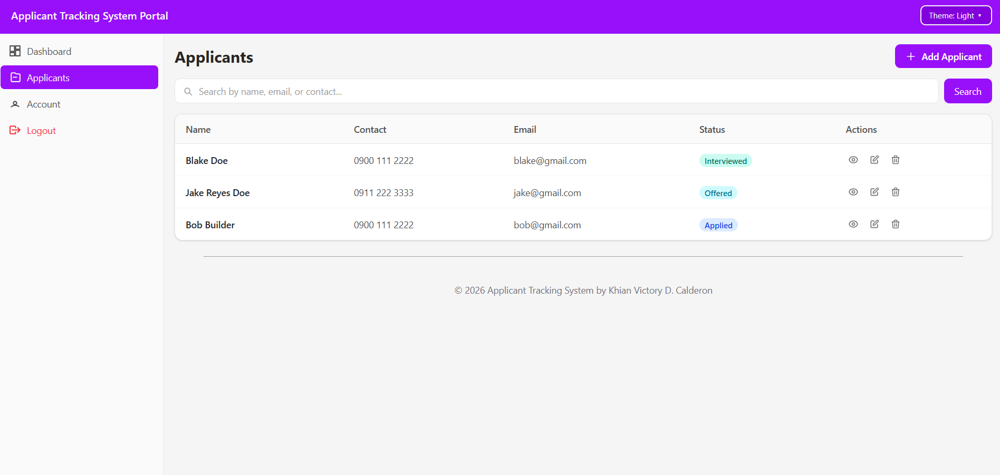 | 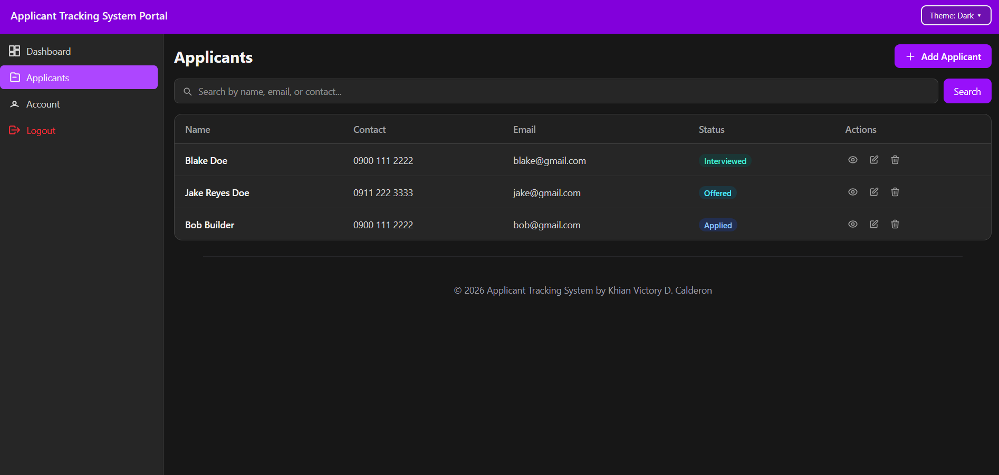 |
| Add Applicants | 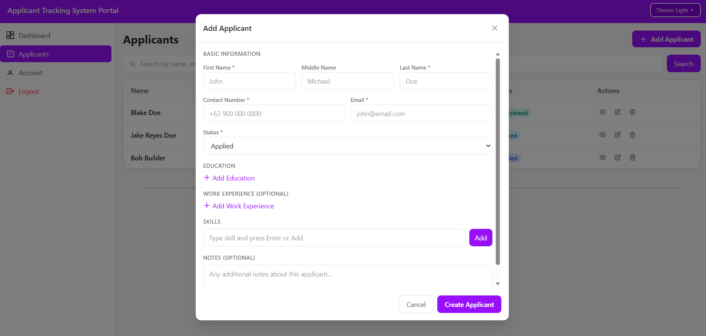 | 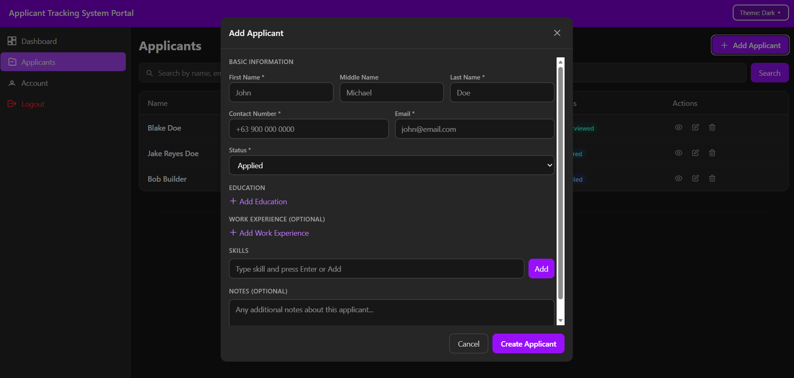 |

## Usage (2 Roles):
- Admin
  - Credentials: Default Username: `admin@asp.net`, Default Password: `@Admin123456`
  - Admin Dashboard Page: Summary of user's data (max of 4 graphs only)
  - Manage Users Page: Can see every other user's data (READ ONLY though)
- Member (The HR Interviewer, based on assumptions only)
  - Dashboard Page: Read only data about summary of all applicants (max of 4 graphs only)
  - Applicants Page: Can create, read, update, and delete applicant data such as (table form + pagination + searchable applicant):
    - first name
    - middle name (optional)
    - last name
    - contact number
    - email
    - education (list input { school, degree, year started, year ended })
    - work experience (list input { company name, position, year started, year ended } optional)
    - skills (list chip input)
    - notes (textarea optional)
    - statuses:
      ```html
      <select>
        <option>Applied</option>
        <option>Under Review</option>
        <option>Shortlisted</option>
        <option>Interview Scheduled</option>
        <option>Interviewed</option>
        <option>Offered</option>
        <option>Hired</option>
        <option>Rejected</option>
        <option>Withdrawn</option>
      </select>
      ```

#### Tech Stacks:
- **Vite React (Typescript)**
- **Tailwind CSS**
- **ASP.NET Core Web API**
- **MS SQL Server**

---

## Prerequisites
- NodeJS
- .NET Core
- MS SQL Server

---

### Inside `backend` folder:
1. Update the `appsettings.Development.json` depending on your frontend origin *(The `"Cors": { "AllowedOrigins": [] }` part)* and the `"ConnectionStrings": { "DefaultConnection": "..." } ` for your own sql server database.
2. Run this if you haven't installed entity framework before:
    ```cmd
    dotnet tool install --global dotnet-ef --version 8.0.0
    ```
    *NOTE: Latest version is unstable with the current setup so I use 8.0.0*
3. Run the following CMD comamnds:
    
    *NOTE: Only run this if you don't see a folder named `Migrations`*
    ```
    dotnet ef migrations add InitialCreate
    ```
    
    *To actually create tables in the databases, run this*
    ```
    dotnet ef database update
    ```
4. Run `dotnet clean` to clean unnecessary things.
5. Run `dotnet watch run` to run your backend.

### Inside `frontend` folder:
1.  Create an `.env` file that contains:
    ```env
    VITE_API_URL=https://your-backend.com
    ```
    **NOTE**:
      - *Change `VITE_API_URL` into the actual backend host without trailing slash.*
2. Run `npm install` to install necessary packages.
3. Run `npm run dev` to test your development frontend.

---

## Backend Dependencies & Configuration
The following is a list of installed dependencies and configuration settings used in this project.
You don’t need to install anything manually, as all dependencies are already managed through `project-name.csproj`.
This section is provided for reference only, to give you insight into how the project was set up.

## Backend Dependencies:
*(Note: Some dependencies are intentionally using old versions for stable releases)*
- `dotnet add package BCrypt.Net-Next --version 4.0.3`
- `dotnet add package Microsoft.EntityFrameworkCore --version 8.0.0`
- `dotnet add package Microsoft.EntityFrameworkCore.SqlServer --version 8.0.0`
- `dotnet add package Microsoft.EntityFrameworkCore.Tools --version 8.0.0`
    
## Frontend Dependencies & Configuration
The following is a list of installed dependencies and configuration settings used in this project.
You don’t need to install anything manually, as all dependencies are already managed through `package.json` (both frontend and backend).
This section is provided for reference only, to give you insight into how the project was set up.

## Frontend Dependencies
- `npm install tailwindcss @tailwindcss/vite axios react-router-dom react-chartjs-2`

## Frontend Configuration
- Update `vite.config.ts`:
  ```ts
  import tailwindcss from '@tailwindcss/vite'

  export default defineConfig({
    plugins: [
      tailwindcss(),
    ],
  })
  ```